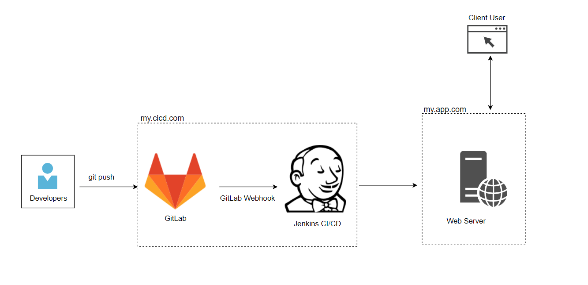
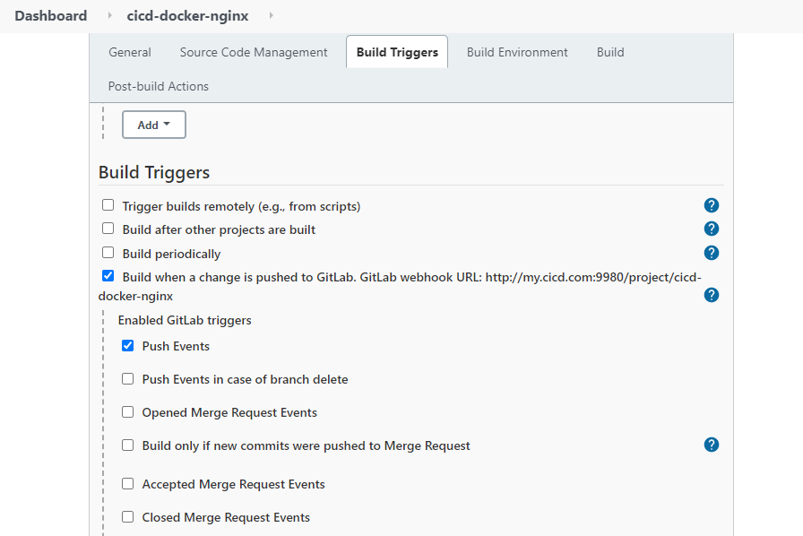
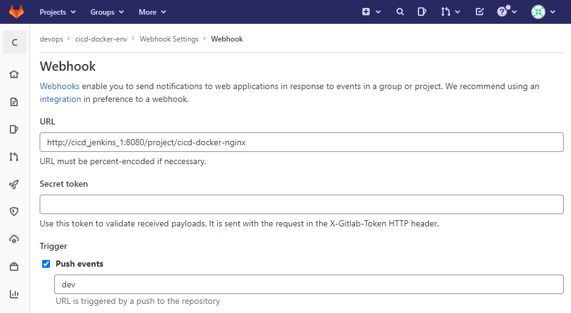

# Gitlab Jenkins CI/CD to Nginx

## Project Introduction

This project is about building CI/CD environment (hostname: my.cicd.com) through hosting Gitlab and Jenkins environment in containers via docker-compose; and then deploying the application source to web server (hostname: my.app.com) in a Nginx container for web host.

## Structure Diagram



## Detailed Design

1. in `my.cicd.com` host, Gitlab and Jenkins are setup through docker-compose

   ```yaml
   version: '3.9'
   services:
     gitlab:
       image: gitlab/gitlab-ce:latest
       restart: always
       hostname: my.cicd.com
       environment: 
         GITLAB_OMNIBUS_CONFIG: |
           external_url 'http://my.cicd.com:9280'
           unicorn['worker_timeout'] = 60
           unicorn['worker_process'] = 3 
           unicorn['worker_memory_limit_min'] = "200 * 1 << 20"
           unicorn['worker_memory_limit_max'] = "300 * 1 << 20" 
           sidekiq['concurrency'] = 10
           postgresql['shared_buffers'] = "128MB"
           postgresql['max_worker_process'] = 8
       networks:
         - mycicd
       ports:
         - "9280:9280"
         - "9222:22"
         - "9243:443"
       volumes:
         - ./gitlab/config:/etc/gitlab
         - ./gitlab/logs:/var/log/gitlab
         - ./gitlab/data:/var/opt/gitlab
     
     jenkins:
       image: jenkinsci/blueocean
       restart: always
       privileged: true
       user: root
       volumes:
         - type: bind
           source: ./jenkins/jenkins_home
           target: /var/jenkins_home
         - type: bind
           source: /var/run/docker.sock
           target: /var/run/docker.sock
           read_only: "yes"
       networks:
         - mycicd
       ports:
         - "9980:8080"
     
   networks:
     mycicd:
   ```

2. GitLab Webhook is utilized to trigger Jenkins build whenever push events happening on "Dev" branch.
   
   

3. Provide the running Jenkins' docker container SSH key to the app server for secure connection, then using `deploy.sh`scripts to perform build actions on `my.app.com`server

   ```shell
   host=<my.app.com server ip>
   ssh root@$host "
                   mkdir -p /home/cicd_nginx
                   cd /home/cicd_nginx
                   docker-compose ps -q
                   if [[ -n $? ]]; then docker-compose down; fi
                   wait
                   echo 'shut-down complete'
                   rm -rf /home/cicd_nginx/*
   "
   scp -rp  $WORKSPACE/. root@$host:/home/cicd_nginx/
   ssh root@$host "cd /home/cicd_nginx && docker-compose up -d"
   ```

4. Docker-compose will run the nginx container in `my.app.com` for web hosting (can also run lnmp stack with modified docker-compose.yml file)

## Instruction

1. configure two host machines with hostname `my.cicd.com` and `my.app.com` respectively, and they can communicate with each other

3. install docker and docker-compose on both host machines

4. make sure firewalld allows port 9280 and 9980 on `my.cicd.com`, and port 8080 on `my.app.com`

5. `git clone` this repo to `my.cicd.com` host

5. In the project directory, simply run command:

   ```shell
   $ sudo docker-compose up -d
   ```

6. resolve both dns name and visit `my.cicd.com:9280` and `my.cicd.com:9980` for Gitlab and Jenkins respectively

7. configure the Gitlab Webhooks and Jenkins Build Triggers mentioned above

8. on a third machine/environment (developer's environment), configure the SSH key on Gitlab so that source code can be pushed into projects (make sure git is installed)

9. customize the content of web/index.html and initiate `git push origin dev`, verify the Jenkins build has started 

10. once Jenkins build succeed, visit `my.app.com:8080`
